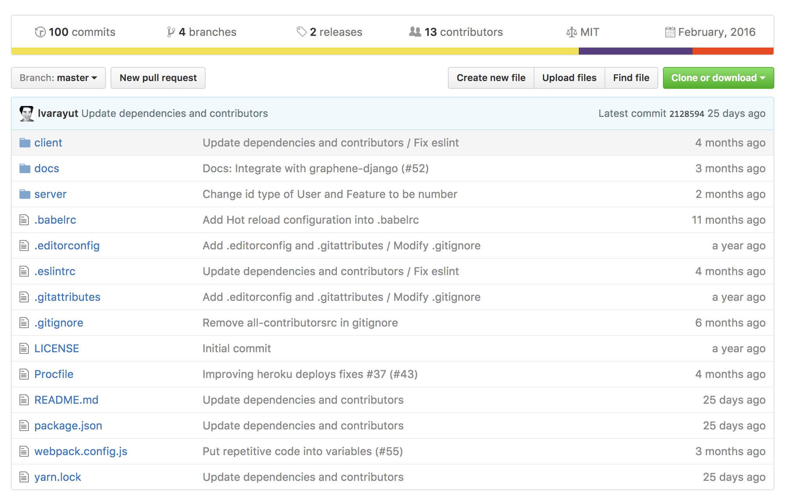
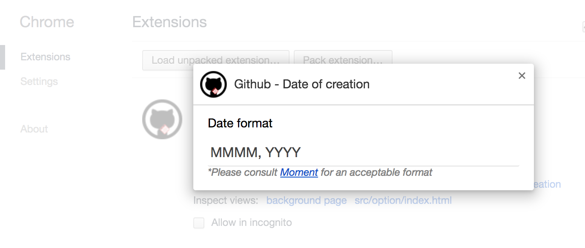

#  Github - Date of Creation 

> Chrome extension for displaying a date of creation of a repository hosted on Github

## Highlights

- Beautiful calendar icon in the summary bar on a repository page
- Customizable date format followed [Moment](https://momentjs.com/docs/#/displaying) format pattern
- Best performance by storing all fetched URIs in the Storage

## Screenshots

**Date of creation of a repository is displaying on the summary bar:**

**Date format is customizable by clicking at the extension icon:**

## Install

Install the extension from the [Chrome Web Store](https://chrome.google.com/webstore/detail/github-date-of-creation/dgnomofcgpdalifennakmbocjpdiafhg).

## License

MIT © [Varayut Lerdkanlayanawat](https://github.com/lvarayut)

